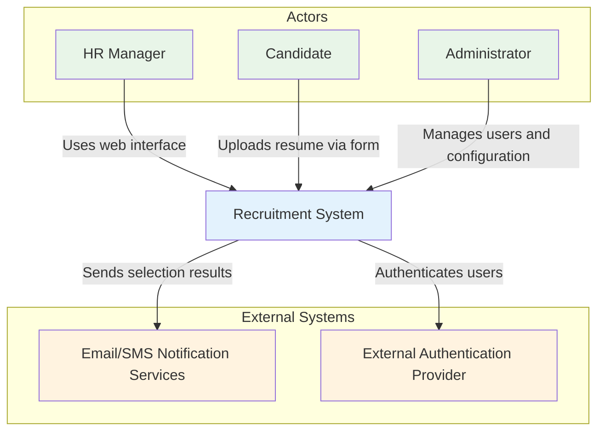
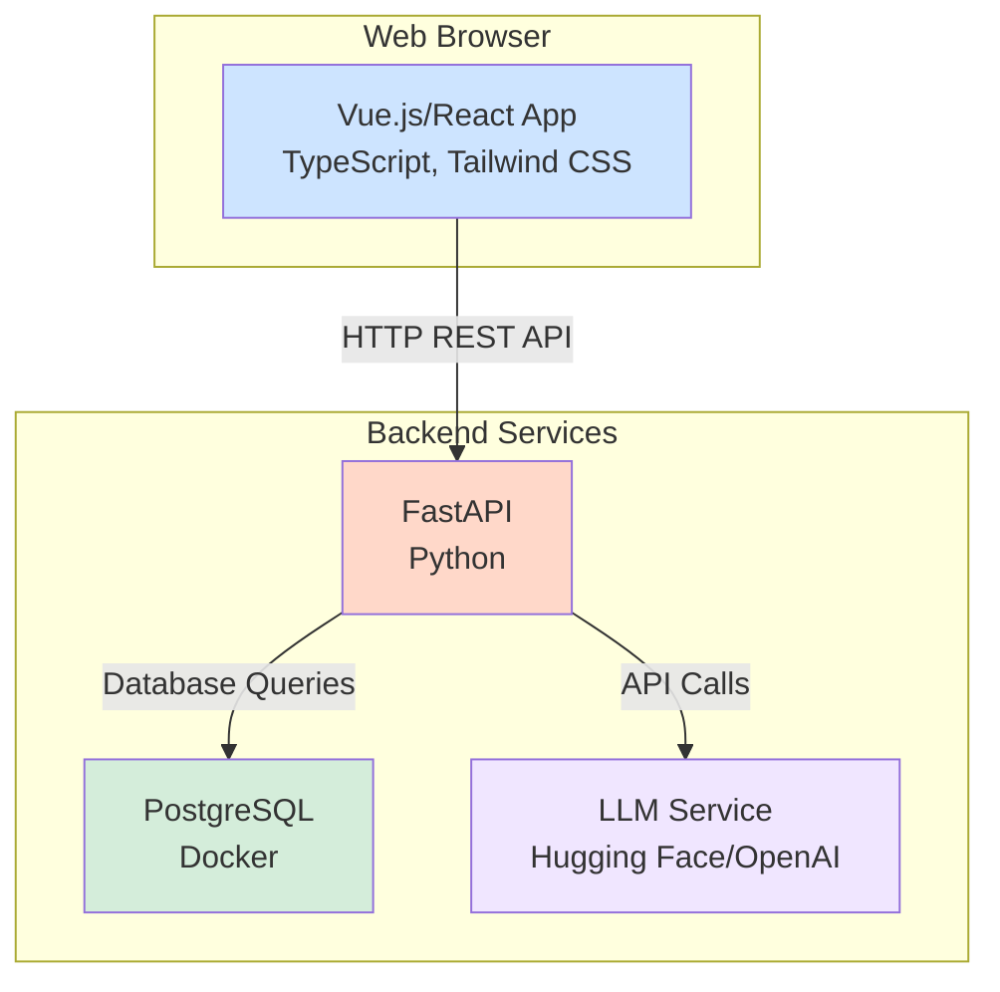
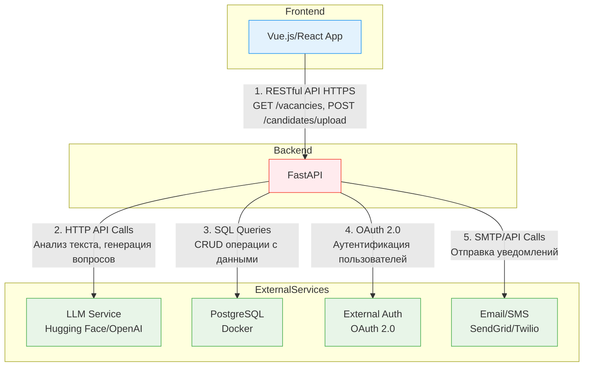

# Система рекрутинга - Полная документация архитектуры

## Контекстная диаграмма

```mermaid
graph TD
    subgraph External Systems
        A1[Email/SMS Notification Services]
        A2[External Authentication Provider]
    end
    
    subgraph Actors
        B1[HR Manager]
        B2[Candidate]
        B3[Administrator]
    end
    
    C[Recruitment System]
    
    B1 -->|Uses web interface| C
    B2 -->|Uploads resume via form| C
    B3 -->|Manages users and configuration| C
    C -->|Sends selection results| A1
    C -->|Authenticates users| A2

    style A1 fill:#fff3e0
    style A2 fill:#fff3e0
    style B1 fill:#e8f5e8
    style B2 fill:#e8f5e8
    style B3 fill:#e8f5e8
    style C fill:#e3f2fd
```

## Диаграмма контейнеров

```mermaid
graph TB
    subgraph Browser [Web Browser]
        A[Vue.js/React App<br/>TypeScript, Tailwind CSS]
    end
    
    subgraph Backend [Backend Services]
        B[FastAPI<br/>Python]
        C[PostgreSQL<br/>Docker]
        D[LLM Service<br/>Hugging Face/OpenAI]
    end
    
    A -->|HTTP REST API| B
    B -->|Database Queries| C
    B -->|API Calls| D
    
    style A fill:#cde4ff
    style B fill:#ffd8c9
    style C fill:#d4edda
    style D fill:#f0e6ff
```

## Детализация интерфейсов между компонентами

```mermaid
graph TB
    subgraph Frontend
        FE[Vue.js/React App]
    end
    
    subgraph Backend
        API[FastAPI]
    end
    
    subgraph ExternalServices
        LLM[LLM Service<br/>Hugging Face/OpenAI]
        DB[PostgreSQL<br/>Docker]
        AUTH[External Auth<br/>OAuth 2.0]
        NOTIFY[Email/SMS<br/>SendGrid/Twilio]
    end
    
    FE -->|1. RESTful API HTTPS<br/>GET /vacancies, POST /candidates/upload| API
    API -->|2. HTTP API Calls<br/>Анализ текста, генерация вопросов| LLM
    API -->|3. SQL Queries<br/>CRUD операции с данными| DB
    API -->|4. OAuth 2.0<br/>Аутентификация пользователей| AUTH
    API -->|5. SMTP/API Calls<br/>Отправка уведомлений| NOTIFY
    
    classDef frontend fill:#e3f2fd,stroke:#2196f3
    classDef backend fill:#ffebee,stroke:#f44336
    classDef external fill:#e8f5e8,stroke:#4caf50
    
    class FE frontend
    class API backend
    class LLM,DB,AUTH,NOTIFY external
```

