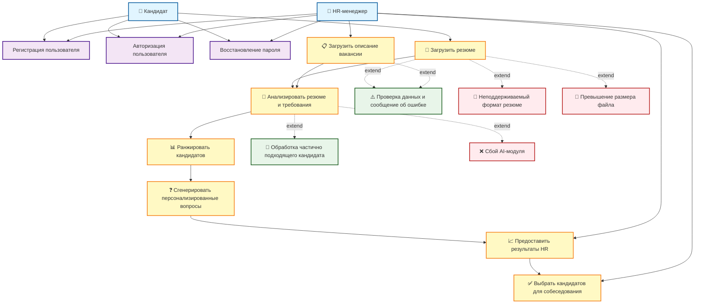

## Use cases
### 1. Загрузка и анализ вакансии с резюме
Ввод: HR загружает описание вакансии (должность, требования, навыки) и набор резюме кандидатов (PDF, DOCX).
Выход: Список кандидатов с рейтингом соответствия (0-100%), ключевые совпадения и несоответствия по навыкам, персональные вопросы для топ-5 кандидатов.
Успех: HR открывает профили минимум 2-3 кандидатов из топ-5 и приглашает их на собеседование в течение 10 минут.

### 2. Обработка неполных данных в резюме
Ввод: Резюме с отсутствующими обязательными полями (опыт работы, образование) или вакансия без четких требований.
Выход: Валидация с подробным сообщением об ошибках, список недостающих полей с рекомендациями по заполнению, возможность продолжить с предупреждением.
Успех: Пользователь исправляет данные за 1 попытку, система успешно обрабатывает обновленную информацию.

### 3. Работа с частично подходящими кандидатами
Ввод: Резюме кандидата, соответствующего 50-70% требований вакансии.
Выход: Анализ пробелов в навыках, предложение альтернативных путей (обучение, испытательный срок), дополнительные вопросы для оценки потенциала и мотивации, сравнение с похожими успешными кейсами.
Успех: HR рассматривает кандидата как перспективного и добавляет его в список для собеседования с пометкой "требует развития навыков".

### 4. Генерация персонализированных вопросов для интервью
Ввод: Профиль кандидата с опытом работы и требования вакансии.
Выход: 5-7 персональных вопросов на основе опыта кандидата, 3-5 технических вопросов по ключевым навыкам, поведенческие вопросы для оценки soft skills.
Успех: HR использует минимум 3 вопроса из списка на собеседовании, отмечает их релевантность как высокую.

### 5. Обработка технических сбоев и неподдерживаемых форматов
Ввод: Загрузка резюме в неподдерживаемом формате (.pages, .odt) или технический сбой AI-модуля.
Выход: Уведомление с указанием проблемы, список поддерживаемых форматов (PDF, DOCX, TXT), инструкция по конвертации, автоматическая регистрация ошибки в техподдержке.
Успех: Пользователь конвертирует файл и успешно загружает его повторно, либо получает уведомление о восстановлении сервиса в течение 15 минут.

# Use Case Diagram – Система подбора персонала с ИИ

